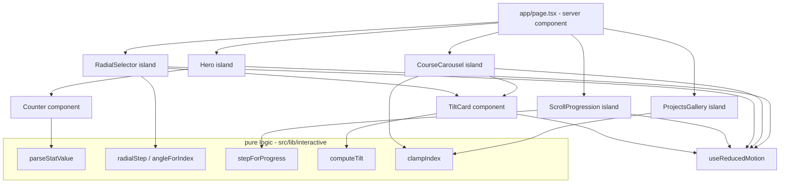

# Design Document

## Overview

This feature layers six lightweight interactive experiences onto the existing Next.js homepage: an animated hero with number counters, a swipeable course carousel, a radial course selector, tilt cards, a scroll-driven progression section, and a swipeable projects gallery. The design keeps the current server-rendered page structure intact and introduces small client components ("islands") for interactivity.

Core principles:

- **Pure logic, thin views.** Every interaction that has meaningful behavior (counter parsing, radial index math, scroll-to-step mapping, tilt clamping, gallery bounds) is implemented as a small pure function in `src/lib/interactive/`. React components consume those functions. This keeps the animation code thin and makes the behavior unit- and property-testable without a DOM.
- **Reduced motion first.** A single `useReducedMotion` signal (from Framer Motion) gates every animation. When reduced motion is active, components render their final, fully-readable state.
- **Lazy heavy code.** Framer Motion is already used across the site and is treated as a baseline dependency. Any Heavy_Library (GSAP, Three.js) is loaded via `next/dynamic` with `ssr: false` and a placeholder, only for the section that needs it. The initial homepage bundle never imports a Heavy_Library at module top level.

## Architecture



Data flow: `app/page.tsx` stays a server component that fetches CMS content and passes plain data props into the client islands. Islands own local interaction state and call the pure functions in `lib/interactive` to derive what to render.

## Components and Interfaces

### Pure logic modules (`src/lib/interactive/`)

```typescript
// counter.ts
export interface ParsedStat {
  target: number;      // numeric portion, 0 when none present
  prefix: string;      // characters before the number
  suffix: string;      // characters after the number (e.g. "+", "%")
  hasNumber: boolean;  // false when the value has no digits
}
export function parseStatValue(value: string): ParsedStat;
// Reassemble a displayed value from a parsed stat and a current count.
export function formatStat(parsed: ParsedStat, current: number): string;

// radial.ts
export function angleForIndex(index: number, count: number): number; // degrees, 0..360
export function radialStep(focusIndex: number, delta: number, count: number): number; // wraps via modulo

// progression.ts
export function stepForProgress(progress: number, stepCount: number): number; // 0..stepCount-1

// tilt.ts
export interface Tilt { rotateX: number; rotateY: number; }
export function computeTilt(
  offsetX: number, offsetY: number, // pointer offset from center, normalized -1..1
  maxDeg: number
): Tilt;

// bounds.ts
export function clampIndex(index: number, length: number): number; // 0..length-1, safe for length 0
```

### Client islands (`src/components/interactive/`)

- **Counter.tsx** — Renders one animated stat. Uses `parseStatValue`; animates `target` with Framer Motion's `useMotionValue`/`animate`, formats via `formatStat`. Under reduced motion, renders `formatStat(parsed, parsed.target)` immediately.
- **CourseCarousel.tsx** — Horizontal drag/scroll list of `CourseCard`s. Keyboard: Left/Right arrows move focus between items. Uses `clampIndex` for programmatic navigation.
- **RadialSelector.tsx** — Circular arrangement using `angleForIndex`; next/prev buttons and Left/Right keys call `radialStep`. Exposes accessible names on the rotate controls.
- **TiltCard.tsx** — Wrapper applying `computeTilt` on pointer/touch move, resetting on leave; no-op under reduced motion.
- **ScrollProgression.tsx** — Uses Framer Motion `useScroll` for section progress, `stepForProgress` to pick the active step. Under reduced motion, renders all steps as a static ordered list.
- **ProjectsGallery.tsx** — Swipeable gallery; next/prev via swipe, buttons, and keys, bounded via `clampIndex`.
- **LazySection.tsx** — Wraps any section needing a Heavy_Library with `next/dynamic(..., { ssr: false, loading: Placeholder })`.

### Integration

`app/page.tsx` replaces the static `Stats` numbers with `Counter`, adds `CourseCarousel`/`RadialSelector` alongside the existing `Courses` grid, and inserts `ScrollProgression` and `ProjectsGallery` sections. Existing components remain; new islands are additive.

## Data Models

Reuses existing types from `src/lib/data/types.ts`:

- `SiteSettings.stats` (`studentsTrained`, `coursesOffered`, `yearsExperience`, `placementRate`) drive the Counters.
- `Course[]` drives the carousel and radial selector.

New client-only view models (not persisted):

```typescript
// Projects gallery content (static for this iteration, no Firestore model)
interface ProjectItem {
  title: string;
  student: string;
  imageUrl?: string;
}

// Scroll progression steps (static content)
interface ProgressionStep {
  label: string;
  description: string;
}
```

## Correctness Properties

*A property is a characteristic or behavior that should hold true across all valid executions of a system—essentially, a formal statement about what the system should do. Properties serve as the bridge between human-readable specifications and machine-verifiable correctness guarantees.*

The prework showed that the meaningful, deterministic behavior of every interactive section lives in the pure functions in `src/lib/interactive/`. The gesture/DOM/rendering branches (drag physics, reduced-motion render selection, dynamic import loading, accessibility markup) are validated by unit and integration checks rather than properties. After reflection, the many parse/index/bounds criteria collapse into six distinct properties.

### Property 1: Stat parse/format round-trip and pass-through

*For any* stat string, parsing it with `parseStatValue` and then formatting at the parsed target with `formatStat` reproduces the original meaningful value; and *for any* string containing no digits, the formatted result equals the input unchanged.

**Validates: Requirements 1.1, 1.2, 1.3**

### Property 2: Radial angles are evenly distributed

*For any* course count greater than zero and any index in range, `angleForIndex(index, count)` equals `index * (360 / count)` and lies in the half-open range 0 (inclusive) to 360 (exclusive).

**Validates: Requirements 3.1**

### Property 3: Radial step stays in range and wraps

*For any* course count greater than zero, any starting focus index in range, and any integer step delta (positive or negative), `radialStep(focusIndex, delta, count)` returns an index in the range 0 to count minus one, and applying a delta of +1 then -1 returns the original focus index.

**Validates: Requirements 3.2, 3.3, 3.4**

### Property 4: Scroll progress maps to a valid bounded step

*For any* scroll progress value in the range 0 to 1 and any step count greater than zero, `stepForProgress(progress, stepCount)` returns an index in the range 0 to step count minus one, equal to the minimum of the floor of progress times step count and step count minus one; progress 0 maps to 0 and progress 1 maps to step count minus one.

**Validates: Requirements 5.1, 5.2**

### Property 5: Tilt is clamped and directionally correct

*For any* pointer offsets (including values outside the normalized range) and any positive maximum degree, `computeTilt` returns rotations whose magnitude on each axis does not exceed the maximum degree, whose sign on each axis matches the sign of the corresponding offset, and which are both zero when both offsets are zero.

**Validates: Requirements 4.1, 4.2, 4.3**

### Property 6: Index clamping stays within bounds

*For any* requested index (including negative and out-of-range values) and any list length (including zero), `clampIndex(index, length)` returns 0 when the length is zero, and otherwise returns a value in the range 0 to length minus one.

**Validates: Requirements 2.2, 6.1, 6.2, 2.3, 6.3, 3.5**

## Error Handling

- **Empty or zero-length collections:** `clampIndex`, `angleForIndex`, and `radialStep` are defined to be safe when count/length is zero (returning 0 or a no-op) so components never index into empty arrays. Islands additionally short-circuit rendering to an empty-but-valid container when their data array is empty (Requirements 2.3, 3.5, 6.3).
- **Non-numeric stat values:** `parseStatValue` returns `hasNumber = false` and the raw text as prefix, so `formatStat` passes the value through unchanged (Requirement 1.3).
- **Out-of-range pointer offsets:** `computeTilt` clamps before applying so extreme or unnormalized pointer input cannot exceed the max rotation (Requirement 4.2).
- **Dynamic import failure:** `LazySection` renders its placeholder if the dynamically imported module has not resolved; a failed import leaves the placeholder in place rather than crashing the page (Requirement 7.3).
- **Reduced motion:** all islands read `useReducedMotion` and render final content directly, avoiding any motion-value setup (Requirements 1.4, 2.4, 4.4, 5.3, 8.1).

## Testing Strategy

### Frameworks

- **Property-based and unit testing:** Vitest as the test runner with `fast-check` for property-based tests. These are added as dev dependencies; Vitest is configured to run in a jsdom environment for the few component-level checks.
- Each property-based test is configured to run a minimum of 100 iterations (`fc.assert(..., { numRuns: 100 })`).

### Unit tests

Unit tests cover concrete examples and edge cases that complement the properties:

- `parseStatValue` on representative inputs: `"500+"`, `"15+"`, `"5+"`, `"95%"`, `"Coming soon"` (no digits), `""` (empty).
- `clampIndex` at boundaries: length 0, index -1, index at length, index 0.
- `radialStep` and `angleForIndex` at count 1 and count 0.
- `stepForProgress` at progress 0, 1, and a mid value.
- A lightweight component render check that reduced motion shows final stat text (integration-style, optional).

### Property-based tests

Each correctness property is implemented by exactly one property-based test. Every property test is tagged with a comment in this exact format:

`**Feature: interactive-homepage, Property {number}: {property_text}**`

Mapping:

- Property 1 → `parseStatValue`/`formatStat` round-trip and pass-through (generators include numeric-prefixed, suffixed, and no-digit strings).
- Property 2 → `angleForIndex` even distribution (generator: count ≥ 1, index in range).
- Property 3 → `radialStep` range and wrap (generators include count ≥ 1, arbitrary integer deltas including negatives and large values).
- Property 4 → `stepForProgress` bounded mapping (generators: progress in [0,1] via `fc.double`, stepCount ≥ 1).
- Property 5 → `computeTilt` clamp and sign (generators include offsets outside [-1,1] and zero).
- Property 6 → `clampIndex` bounds (generators include negative indices, out-of-range indices, and length 0).

### Notes

- Generators are constrained to the valid input space intelligently (for example, counts and lengths use `fc.nat` with an offset to include or exclude zero as each property requires).
- Property tests exercise pure functions only, so they run without a DOM and stay fast.
